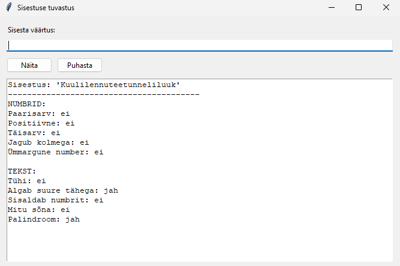
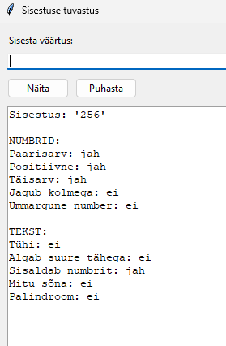

# Sisestuse tuvastus

Python Tkinter GUI rakendus, mis analüüsib kasutaja sisestatud numbrit või teksti ja näitab erinevaid omadusi.

## Mida näitab:
- Paaris või paaritu
- Positiivne või negatiivne
- Täisarv või murdarv
- Jagub kolmaga või mitte
- Ümmargune või mitte
- Jagub kolmega või mitte
- Tühi või mitte
- Algab suure tähega või mitte
- Sisaldab numbrit või mitte
- Üks või mitu sõna
- Palindroom või mitte

