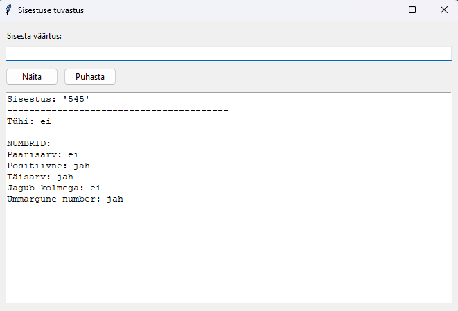
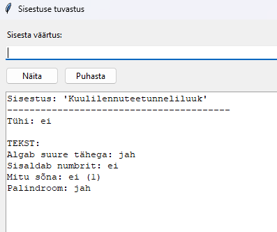

# Sisestuse tuvastus (Tkinter)

Lihtne Python Tkinter programm, mis kontrollib kasutaja sisestust.

Programm tuvastab, kas sisestus on number või tekst, ja näitab
vastavad tulemused kujul **jah / ei**.

## Mida programm teeb

- Näitab alati, kas sisestus on tühi
- Kui sisestus on number:
  - paarisarv
  - positiivne
  - täisarv
  - jagub kolmega
  - ümmargune number
- Kui sisestus on tekst:
  - algab suure tähega
  - sisaldab numbrit
  - mitu sõna (näitab ka sõnade arvu)
  - palindroom

## Kuvatõmmised

